# אקדמיית ה-Agent - מדריך כניסה, גישה וחיבור Minecraft

עודכן: 2026-09-21

## מטרת המסמך

המסמך מסביר איך מפעילים את לומדת **אקדמיית ה-Agent** בפועל:

- איך מנהלת המערכת מכניסה מורה ומקצה לה את הלומדה.
- איך המורה נכנסת, יוצרת כיתה ומוסיפה תלמידים.
- איך תלמידים מקבלים גישה ללומדה.
- למה יש חיבור ל-Minecraft Education, מה נדרש מבחינת רשיונות, ואיך נפתחים שרת/עולם לשיעור.

המסמך מבוסס על הקוד הקיים בריפו `robotics-for-kids`, בעיקר:

- `classroom-admin.html`, `js/classroom-admin.js`
- `teacher-classrooms.html`, `js/classroom-platform.js`
- `classroom-entry.html`, `classroom-student.html`
- `craftom-school/preview/index.html`
- `craftom-minecraft-lesson-*.html`
- `craftom-agent-academy.html`, `js/craftom-agent-academy.js`
- `kugel-teacher.html`, `kugel-student.html`, `js/kugel-lesson-zero.js`
- `server.js`

## תמונת מוצר קצרה

אקדמיית ה-Agent היא מסלול למידה שבו תלמידים בונים עיר/מערכת בתוך Minecraft Education ומפעילים Agent בעזרת MakeCode/Blockly.

המבנה הפדגוגי:

- 4 אתגרים.
- 16 מפגשים, 4 מפגשים לכל אתגר.
- בכל מפגש יש:
  - סרטון/סיפור משימה.
  - בנייה בתוך Minecraft.
  - תרגול MakeCode/Agent.
  - אקדמיית Agent נפרדת עם Blockly, תצוגת Python וסימולציה.
  - כרטיס יציאה עם צילום/ראיה והסבר קצר.

האתגרים:

1. הרובוט השליח - רצף פקודות, מרחק, פנייה, הנחת חבילה ודיבוג ראשון.
2. קו המשלוחים האוטומטי - לולאות, פעולה חוזרת, start/stop.
3. קו משלוחים חכם - משתנים, if/else ומצב בעולם.
4. העיר החכמה שלי - פרויקט מסכם עם כמה אוטומציות.

## תפקידים במערכת

### מנהלת מערכת

נכנסת למסך:

`classroom-admin.html`

מה היא עושה:

- מבקשת קוד גישה חד-פעמי למייל מנהלת.
- נכנסת עם הקוד.
- מזמינה מורה במייל.
- מקצה למורה לומדות זמינות, למשל:
  - `craftom-agent` - אקדמיית ה-Agent.
  - `minecraft` - מסלול Minecraft Kids הישן/הנפרד.
  - לומדות אחרות: Sisi, Python Turtle, WebCode וכו'.
- יכולה לראות מורים, כיתות ותלמידים.
- יכולה לקשר לתלמידים חשבון Microsoft קיים עם רישיון Minecraft Education.

חשוב: המנהלת לא יוצרת חשבון Microsoft ולא מנפיקה רישיון Minecraft. היא רק מאמתת חשבון קיים.

### מורה

נכנסת למסך:

`teacher-classrooms.html`

או דרך הכניסה המאוחדת:

`classroom-entry.html`

מה היא עושה:

- מממשת הזמנה חד-פעמית אם זו כניסה ראשונה.
- מקבלת סיסמה זמנית שמוצגת פעם אחת.
- נכנסת עם מייל וסיסמה.
- יוצרת כיתה.
- בוחרת אילו לומדות פתוחות לכיתה מתוך הלומדות שהמנהלת הקצתה לה.
- מוסיפה תלמידים ומקבלת לכל תלמיד קוד אישי חד-פעמי להצגה.
- מאמתת וקושרת לכל תלמיד חשבון Microsoft קיים עם רישיון Minecraft Education.
- פותחת את מסך ניהול אקדמיית ה-Agent לכיתה:

`kugel-teacher.html?classroomId=<classroom-id>`

### תלמיד

נכנס דרך:

`classroom-entry.html`

מה התלמיד מקבל מהמורה:

- קוד כיתה משותף.
- קוד אישי לתלמיד/ה.

אחרי כניסה מוצג מסך:

`classroom-student.html`

שם התלמיד רואה רק את הלומדות שהוקצו לכיתה שלו. אם הכיתה קיבלה אקדמיית Agent, יופיע כפתור:

`אקדמיית ה-Agent`

שמוביל אל:

`craftom-school/preview/index.html`

## זרימת הרשמה וכניסה של מורה

### 1. המנהלת מזמינה מורה

1. נכנסים אל `classroom-admin.html`.
2. מזינים מייל מנהלת ומבקשים קוד חד-פעמי.
3. משלימים כניסה עם הקוד.
4. בטופס "הזמנת מורה במייל" מזינים:
   - שם מלא.
   - מייל.
5. המערכת יוצרת הזמנה חד-פעמית ושולחת קוד למורה.

המערכת שומרת הזמנה בטבלת `classroom_teacher_invitations`. הקוד עצמו נשמר כ-hash, לא כטקסט גלוי.

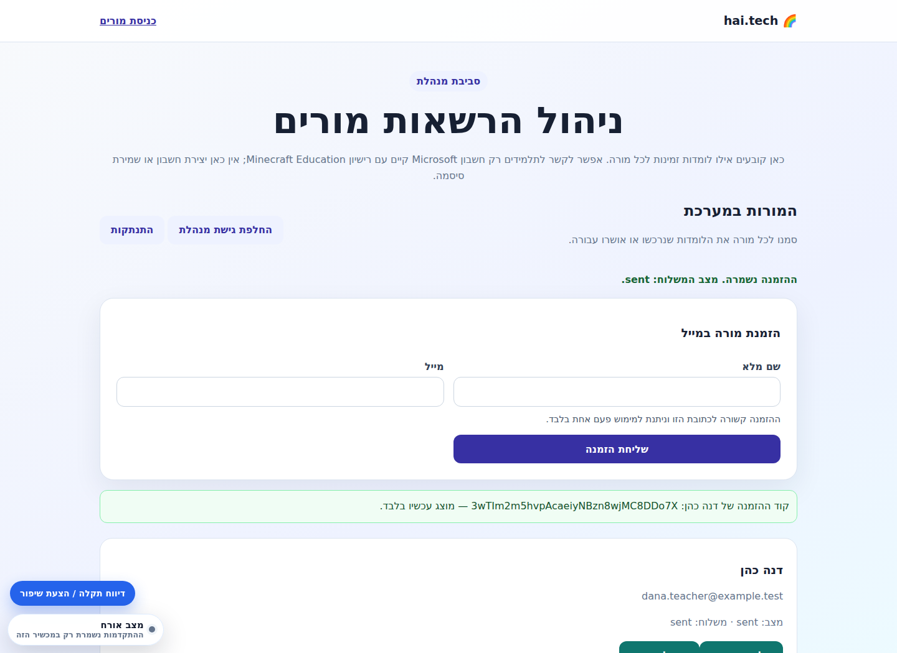

### 2. המורה מממשת הזמנה

1. המורה נכנסת אל `teacher-classrooms.html`.
2. בחלק "מימוש הזמנה למורה" מזינה:
   - מייל.
   - קוד הזמנה חד-פעמי.
3. המערכת יוצרת חשבון מורה ומציגה סיסמה זמנית פעם אחת בלבד.
4. המורה שומרת את הסיסמה הזמנית.
5. לאחר מכן היא נכנסת בטופס "כניסת מורה" עם:
   - מייל.
   - סיסמה.

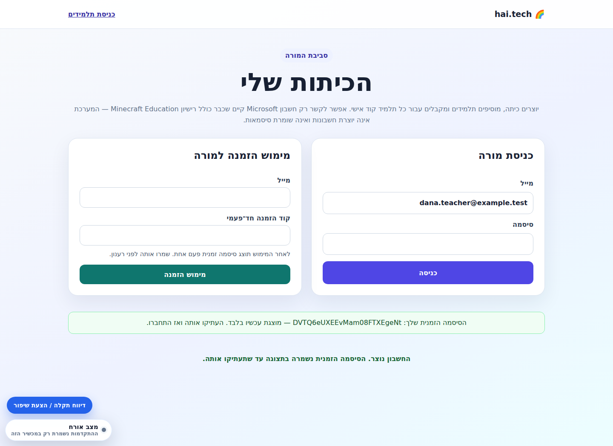

### 3. המנהלת מקצה למורה את אקדמיית ה-Agent

במסך `classroom-admin.html`, בכרטיס המורה:

1. מסמנים את `אקדמיית ה-Agent`.
2. שומרים הרשאות מורה.

ללא הרשאה זו המורה לא תוכל לפתוח כיתה עם אקדמיית ה-Agent.

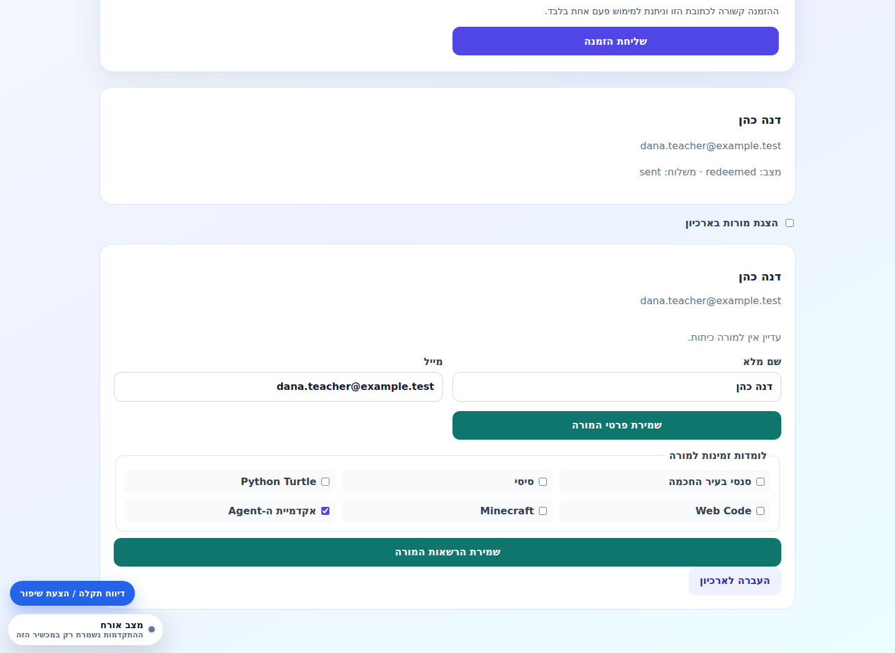

## יצירת כיתה והוספת תלמידים

### יצירת כיתה

במסך `teacher-classrooms.html`:

1. המורה מזינה שם כיתה.
2. בוחרת לומדות פתוחות לכיתה.
3. מסמנת `אקדמיית ה-Agent`.
4. לוחצת "יצירת כיתה".

המערכת יוצרת:

- `classroom.id` פנימי.
- `join_code` - קוד כיתה משותף לתלמידים.
- שורת הרשאות ב-`classroom_courses`.

קוד הכיתה מוצג בכרטיס הכיתה תחת:

`קוד הכיתה לתלמידים`

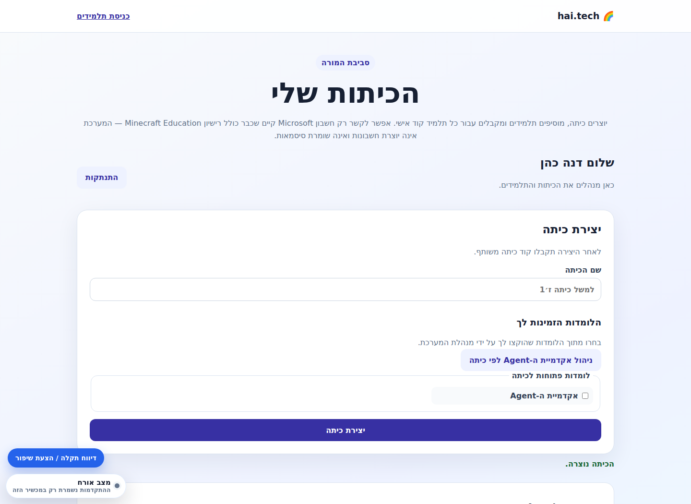

### הוספת תלמידים

בכרטיס הכיתה:

1. מזינים שם תלמיד/ה.
2. לוחצים "הוספת תלמיד/ה".
3. המערכת יוצרת קוד אישי לתלמיד/ה.

הקוד האישי מוצג פעם אחת בלבד. צריך למסור אותו לתלמיד/ה יחד עם קוד הכיתה.

המערכת שומרת hash של הקוד האישי, לא את הקוד הגלוי.

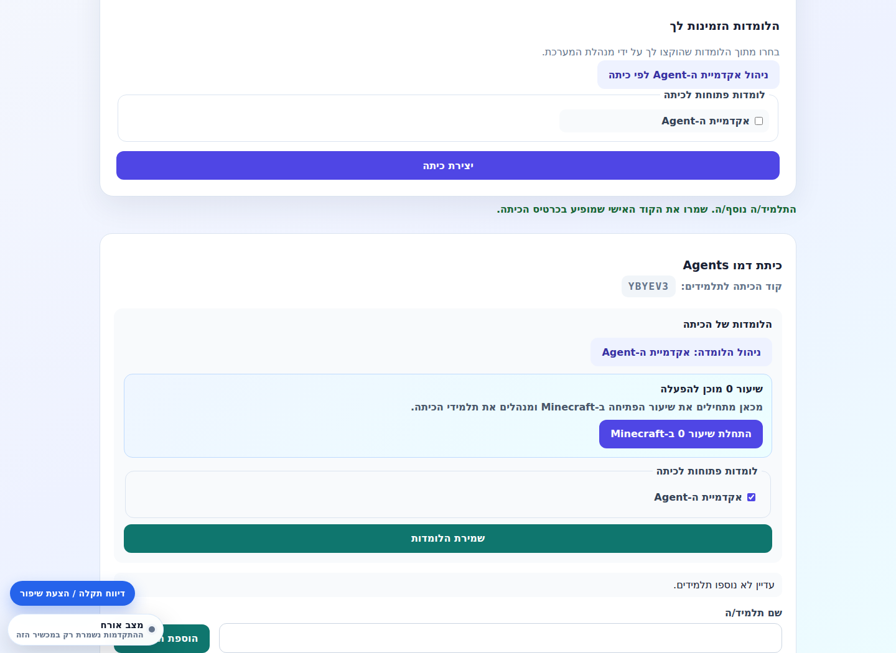

### מה התלמידים מקבלים

כל תלמיד צריך שני פרטים:

1. קוד כיתה - משותף לכל הכיתה.
2. קוד אישי - ייחודי לתלמיד/ה.

התלמיד נכנס ב-`classroom-entry.html`:

- בשדה "מייל או קוד כיתה": קוד הכיתה.
- בשדה "סיסמה או קוד אישי": הקוד האישי.

אם הכניסה מצליחה, נוצרת session של תלמיד ונפתח `classroom-student.html`.

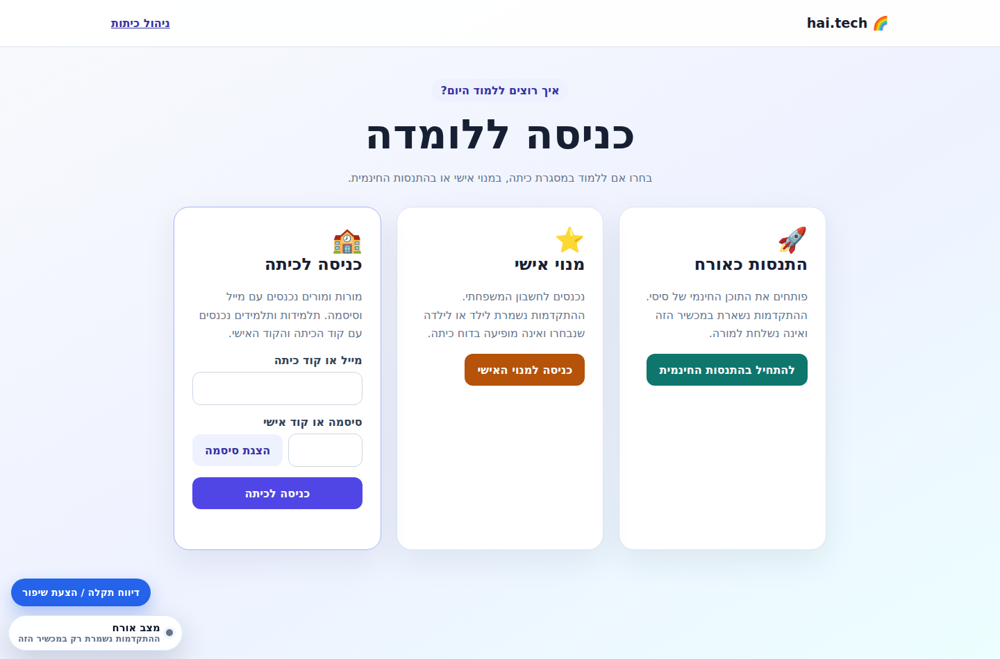

## איך התלמיד נכנס ללומדה

1. התלמיד נכנס אל `classroom-entry.html`.
2. מזין קוד כיתה וקוד אישי.
3. מגיע אל `classroom-student.html`.
4. לוחץ על "אקדמיית ה-Agent".
5. מגיע אל דף הקורס:

`craftom-school/preview/index.html`

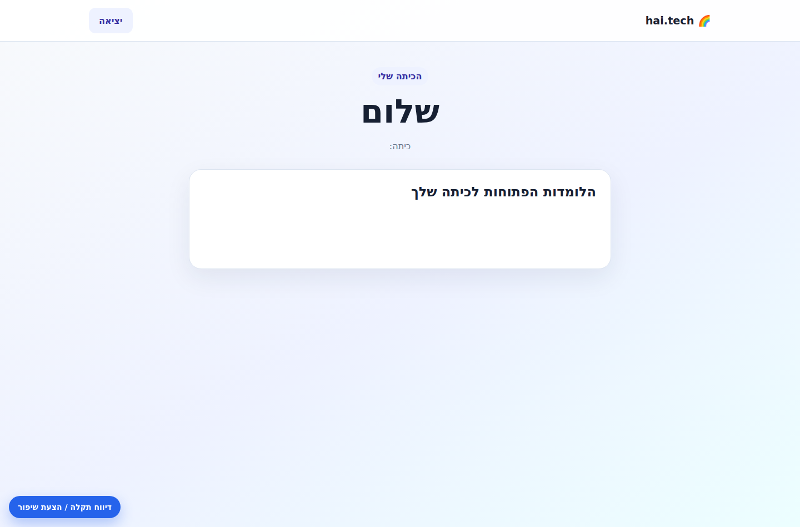

משם יש שני סוגי כניסה עיקריים:

- שיעור 0 / Minecraft live:
  - `kugel-student.html`
- שיעורי הקורס 1-16:
  - `craftom-minecraft-lesson-1.html`
  - ...
  - `craftom-minecraft-lesson-16.html`

בתוך כל שיעור יש גם כניסה לתרגול הפנימי:

`craftom-agent-academy.html?lesson=<lesson-id>`

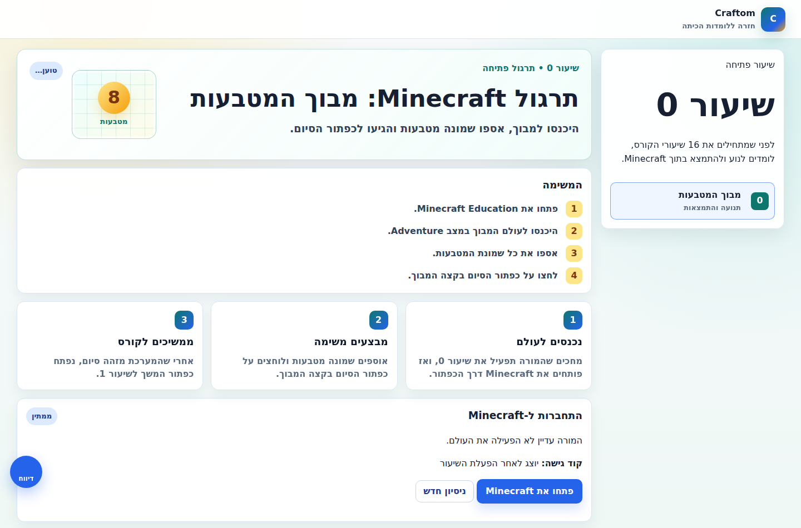

חשוב: שיעור 0 הוא רק שער הכניסה הטכני ל-Minecraft. אחרי שהתלמיד משלים אותו, נפתחים שיעורי הקורס 1-16. בכל שיעור כזה יש:

- דף שיעור עם סיפור משימה, מטרות, MakeCode/Agent וכרטיס יציאה.
- כרטיס "כניסה לעולם Minecraft של השיעור", שמופעל רק כשהמורה פתחה את העולם של אותו שיעור.
- קישור לאקדמיית ה-Agent לתרגול Blockly/Python לפני היישום בעולם Minecraft.

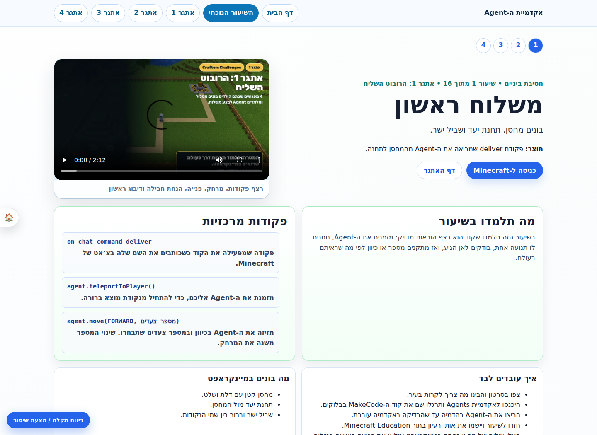

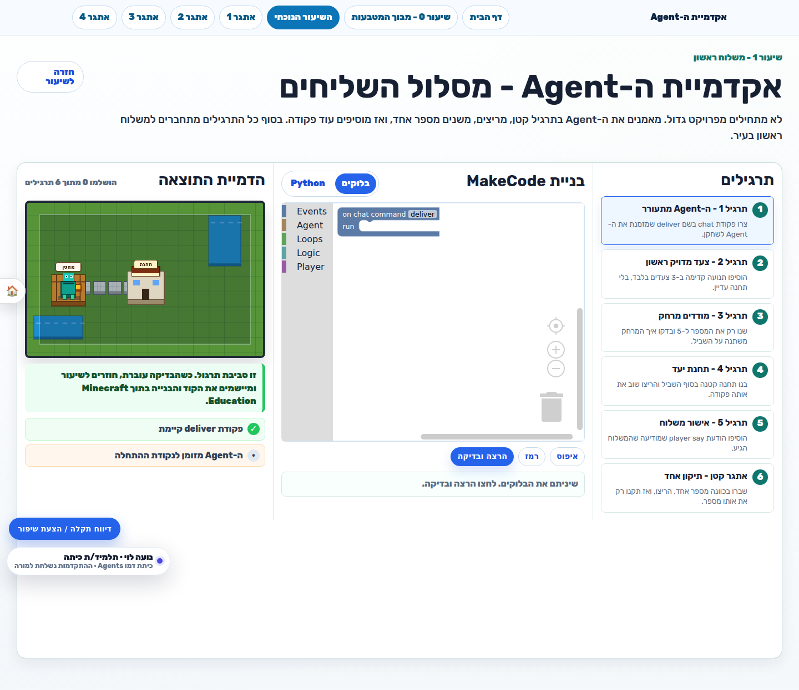

## מהי אקדמיית ה-Agent בתוך השיעור

`craftom-agent-academy.html` היא סביבת תרגול עצמאית בתוך הדפדפן.

היא כוללת:

- רשימת תרגילים.
- Blockly בסגנון MakeCode.
- תצוגת Python מקבילה.
- סימולציה ב-canvas של ה-Agent.
- בדיקות אוטומטיות לכל תרגיל.
- דיווח התקדמות לכיתה רק כשהתרגיל באמת עבר.

למה זה חשוב:

- התלמיד מתרגל את רעיון הקוד לפני שהוא נכנס לעולם Minecraft.
- המורה מקבלת התקדמות שמבוססת על בדיקה אמיתית, לא רק על לחיצה ידנית.
- התלמיד לא מקבל פתרון מוכן; הוא מקבל starter/hint/criteria.

התקדמות נרשמת דרך אירוע `hai:classroom-progress` ונשמרת ב-`classroom_progress`.

## למה יש חיבור ל-Minecraft

אקדמיית ה-Agent אינה רק סימולציה. המטרה היא שהתלמידים יראו את הקוד שלהם משנה עולם אמיתי בתוך Minecraft Education:

- ה-Agent זז בעולם.
- ה-Agent מניח בלוקים/חבילות.
- התלמיד בונה מחסן, תחנה, דרך, שערים, קווי משלוח וכו'.
- בהמשך יש לולאות, תנאים, start/stop ופרויקט עיר חכמה.

לכן יש חיבור ל-Minecraft בשלושה מקומות:

1. **תרגול פתיחה בשיעור 0** - מבוך מטבעות ב-Minecraft.
2. **שיעורי 1-16** - כל שיעור יכול להיפתח לעולם Minecraft מתאים.
3. **מעקב מורה** - המורה רואה מי התחיל, מי התקדם, מי סיים, הגשות וצילומים.

## רשיונות Minecraft וחשבונות Microsoft

המערכת לא מחלקת רשיונות Minecraft Education.

נדרש שלכל תלמיד יהיה מראש:

- חשבון Microsoft קיים.
- UPN תקין בדומיין `@hai.tech`.
- חשבון פעיל (`accountEnabled = true`).
- רישיון Minecraft Education פעיל.
- שם שחקן Minecraft תקין: 2-32 תווים, אותיות/מספרים/קו תחתון.

המורה או המנהלת מזינות:

- חשבון Microsoft קיים, למשל `student@hai.tech`.
- שם שחקן Minecraft, למשל `StudentName_12`.

המערכת שולחת בקשת אימות לשירות verifier:

`ROBOTICS_MINECRAFT_IDENTITY_VERIFIER_URL`

האימות בודק:

- שהמשתמש קיים.
- שהמשתמש פעיל.
- שיש לו רישיון Minecraft Education.
- שה-UPN שחזר מהאימות זהה ל-UPN שהוזן.

אם האימות הצליח, המערכת שומרת:

- UPN.
- שם שחקן.
- `graphObjectId`.
- סטטוס `verified`.
- מקור `microsoft-graph-via-monitor`.

המערכת אינה שומרת סיסמת Microsoft או סיסמת Minecraft.

## מי יכול לקשר חשבון Minecraft

יש שתי אפשרויות:

### מורה

במסך `teacher-classrooms.html`, בכרטיס תלמיד בכיתה שיש לה `craftom-agent` או `minecraft`:

1. מזינים חשבון Microsoft קיים.
2. מזינים שם שחקן Minecraft.
3. לוחצים "אימות וקישור חשבון קיים".

הקריאה היא אל:

`POST /api/classroom/classes/:classroomId/students/:studentId/minecraft/verify`

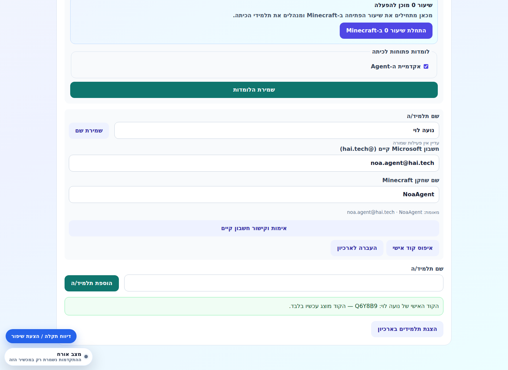

### מנהלת

במסך `classroom-admin.html`, בכרטיס תלמיד:

1. מזינים UPN.
2. מזינים שם שחקן.
3. לוחצים אימות.

הקריאה היא אל:

`POST /api/classroom/admin/students/:studentId/minecraft/verify`

## מה קורה אם אין רישיון או החשבון לא תקין

המערכת לא תאפשר כניסה ל-Minecraft.

שגיאות אפשריות:

- אין שירות verifier מוגדר.
- החשבון לא נמצא.
- החשבון לא פעיל.
- אין רישיון Minecraft Education.
- שם השחקן לא תקין.
- החשבון או שם השחקן כבר מקושרים לתלמיד אחר.
- ההרשאה ללומדה הוסרה בזמן האימות.

המסר החשוב למורה/לקוח:

> כדי להשתמש בחלק ה-Minecraft, צריך חשבונות Microsoft קיימים עם רישיון Minecraft Education. הלומדה מנהלת את השיוך והכניסה, אבל לא יוצרת רשיונות.

## פתיחת שרת/עולם Minecraft לכיתה

מסך המורה:

`kugel-teacher.html?classroomId=<classroom-id>`

במסך זה המורה יכולה:

- לבחור שיעור.
- לפתוח עולם Minecraft לשיעור.
- לעצור את העולם.
- לשלוח הודעה לכיתה.
- לעצור/לשחרר את הכיתה.
- לראות לוח תלמידים ומדדים.

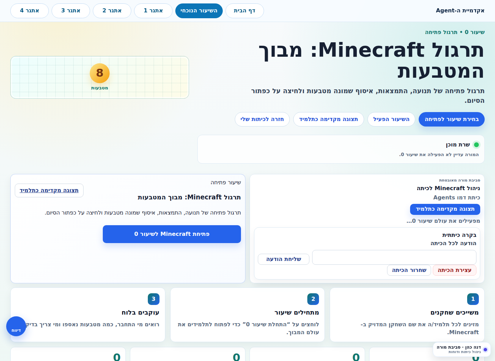

הפעלת שיעור 0:

`POST /api/kugel/classes/:classroomId/launch`

הפעלת שיעור מסוים:

`POST /api/kugel/classes/:classroomId/lessons/:lessonId/launch`

עצירה:

`POST /api/kugel/classes/:classroomId/stop`

הודעה לכיתה:

`POST /api/kugel/classes/:classroomId/message`

עצירה/שחרור:

`POST /api/kugel/classes/:classroomId/freeze`

## איך השרת יודע איזה עולם לפתוח

ב-`server.js` מוגדרים מזהי עולמות:

- שיעור 0:
  - `KUGEL_LESSON_ZERO_WORLD_ID`
- עולם בסיס לאקדמיית Agent:
  - `KUGEL_AGENT_ACADEMY_WORLD_ID`
- שיעור 1:
  - `KUGEL_LESSON_ONE_WORLD_ID`
- שיעורים 2-16:
  - `KUGEL_LESSON_<lessonId>_WORLD_ID`
  - אם אין משתנה ספציפי, חוזרים ל-`KUGEL_AGENT_ACADEMY_WORLD_ID`.

כדי לפתוח עולם באמת, השרת צריך הגדרות סביבה:

- `KUGEL_MONITOR_API_URL` או `MINECRAFT_MONITOR_API_URL`
- `KUGEL_MONITOR_EXPECTED_HOST`
- `ROBOTICS_HTTPS_REVERSE_PROXY=1` בסביבת production מאובטחת
- `KUGEL_MONITOR_SERVER_NAME`
- `KUGEL_MINECRAFT_INTERNAL_TOKEN`
- `KUGEL_MINECRAFT_SERVER_NAME`
- `KUGEL_MINECRAFT_SERVER_HOST`
- `KUGEL_MINECRAFT_SERVER_PORT`
- `KUGEL_MINECRAFT_SERVER_ID`
- `KUGEL_MINECRAFT_ACCESS_CODE`

אם ההגדרות לא קיימות, המערכת תחזיר:

`חיבור Minecraft אינו מוגדר בשרת.`

## מה התלמיד רואה ב-Minecraft

בשיעור 0 התלמיד עובד דרך:

`kugel-student.html`

הוא רואה:

- שם שחקן משויך.
- פרטי שרת.
- קוד גישה.
- כפתור "פתחו את Minecraft".
- התקדמות אישית: מטבעות, ניסיון, סיום.

בשיעורי 1-16 התלמיד עובד דרך דף השיעור:

`craftom-minecraft-lesson-<id>.html`

בתוך הדף יש כרטיס "כניסה לעולם Minecraft של השיעור". הכרטיס פעיל רק אם:

- התלמיד מחובר כ-student.
- הכיתה קיבלה `craftom-agent`.
- המורה פתחה session פעיל לשיעור הזה.
- לתלמיד יש שם שחקן Minecraft מאומת.
- פרטי שרת Minecraft זמינים.

כפתור "פתיחת Minecraft" קורא אל:

`POST /api/kugel/student/start`

ומחזיר פרטי Minecraft כולל launch URL אם יש.

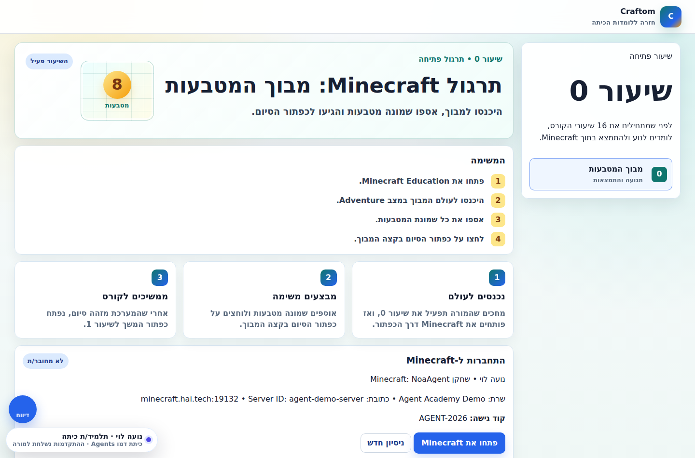

## למה יש שיעור 0

שיעור 0 הוא שכבת הכנה טכנית ופדגוגית:

- בודקים שכל תלמיד מצליח להיכנס ל-Minecraft.
- מוודאים ששם השחקן מקושר נכון.
- מתרגלים תנועה והתמצאות.
- המורה רואה מי מחובר ומי סיים.
- רק אחרי זה ממשיכים לשיעור 1.

המשימה בשיעור 0:

- להיכנס לעולם.
- לאסוף 8 מטבעות.
- ללחוץ על כפתור הסיום.

השלמה נרשמת כ:

- course: `craftom-agent`
- lesson: `0`
- activity: `minecraft-maze`

## איך ההתקדמות נשמרת

התקדמות נשמרת בטבלת `classroom_progress`.

מקורות התקדמות:

- Agent Academy בדפדפן:
  - תרגילים ב-`craftom-agent-academy.html`
  - activity כמו `academy-exercise-1`
  - completion כללי: `academy-complete`
- Minecraft lesson zero:
  - activity `minecraft-maze`
  - נשמר רק אחרי בדיקת אירועי המשחק.
- כרטיס יציאה:
  - activity `exit-ticket`
  - נשמר בצד שרת אחרי הגשה תקינה.

המורה רואה בכרטיסי תלמידים:

- מצב אקדמיה.
- מצב Minecraft.
- מצב כרטיס יציאה.
- הגשה/צילום אם קיים.

## מהי הגשת Craftom / כרטיס יציאה

בסוף שיעור תלמיד מגיש:

- צילום של מה שבנה.
- הסבר קצר.
- תשובה לשאלת reflection.

ההגשה עוברת אל:

`POST /api/craftom/exit-ticket`

הקבצים נשמרים תחת:

`data/craftom-exit-ticket-attachments`

המורה רואה את ההגשות במסך הניהול.

## זרימה מומלצת להפעלה בכיתה

### לפני השיעור הראשון

1. מנהלת מזמינה מורה.
2. מנהלת מקצה למורה את `אקדמיית ה-Agent`.
3. המורה יוצרת כיתה עם `אקדמיית ה-Agent`.
4. המורה מוסיפה תלמידים.
5. המורה מחלקת לכל תלמיד:
   - קוד כיתה.
   - קוד אישי.
6. המורה/מנהלת מאמתת לכל תלמיד חשבון Microsoft קיים עם רישיון Minecraft Education.

### בשיעור 0

1. המורה נכנסת אל `teacher-classrooms.html`.
2. בכיתה הרלוונטית לוחצת "התחלת שיעור 0 ב-Minecraft".
3. נפתח `kugel-teacher.html?classroomId=...`.
4. המורה לוחצת התחלת שיעור/פתיחת Minecraft.
5. התלמידים נכנסים דרך `classroom-entry.html`.
6. התלמידים פותחים `kugel-student.html`.
7. כל תלמיד פותח Minecraft, נכנס לעולם, אוסף 8 מטבעות ולוחץ סיום.
8. המורה רואה מי סיים.

### בשיעורים 1-16

1. המורה בוחרת שיעור ב-`kugel-teacher.html`.
2. פותחת עולם Minecraft לשיעור.
3. התלמידים נכנסים ללומדה מתוך `classroom-student.html`.
4. התלמידים לומדים בדף השיעור.
5. התלמידים מתרגלים ב-`craftom-agent-academy.html?lesson=N`.
6. התלמידים חוזרים לשיעור ומיישמים ב-Minecraft.
7. התלמידים מגישים צילום והסבר.
8. המורה עוקבת בלוח.

## נקודות תפעול חשובות

### קוד אישי של תלמיד מוצג פעם אחת

אם הקוד אבד:

- המורה עושה "איפוס קוד אישי".
- המערכת מציגה קוד חדש פעם אחת.
- כל sessions קודמים של התלמיד מתנתקים.

### הסרת הרשאה עוצרת Minecraft

אם מנהלת מסירה מהמורה `craftom-agent`, או מורה מסירה מהכיתה את הלומדה:

- המערכת מוחקת/מנקה הרשאות רלוונטיות.
- אם יש עולם Minecraft פעיל, המערכת מנסה לסגור אותו.
- זה מונע מצב שבו כיתה ממשיכה להשתמש בשרת אחרי שההרשאה הוסרה.

### תלמיד בארכיון

העברה לארכיון:

- מנתקת sessions.
- מסתירה את התלמיד מהכיתה הפעילה.
- שומרת היסטוריה/שיוך Minecraft לצורך שחזור.

שחזור:

- מחזיר את התלמיד לכיתה.
- לא מציג מחדש את הקוד האישי.

### הרשאות כפולות: מורה וכיתה

כדי שתלמיד יראה/יפעיל את אקדמיית ה-Agent:

- המורה צריכה לקבל `craftom-agent`.
- הכיתה צריכה לכלול `craftom-agent`.
- התלמיד צריך להיות פעיל בכיתה.

כדי שתלמיד ייכנס ל-Minecraft:

- כל התנאים למעלה.
- חשבון Minecraft מאומת.
- עולם פעיל לשיעור.
- שרת Minecraft מוגדר וזמין.

## מילון קצר

- **Admin / מנהלת** - מנהלת הרשאות מורים והזמנות.
- **Teacher / מורה** - יוצרת כיתות, מוסיפה תלמידים, מפעילה שיעורי Minecraft.
- **Student / תלמיד** - נכנס עם קוד כיתה וקוד אישי.
- **craftom-agent** - מזהה הקורס של אקדמיית ה-Agent.
- **Kugel** - שם פנימי לחיבור Minecraft/live classroom.
- **UPN** - כתובת Microsoft של המשתמש, למשל `student@hai.tech`.
- **Minecraft identity** - שיוך בין תלמיד במערכת לבין UPN + שם שחקן Minecraft.
- **Verifier** - שירות חיצוני/פנימי שמוודא שהחשבון קיים, פעיל ובעל רישיון Minecraft Education.
- **World ID** - מזהה עולם Minecraft שהשרת פותח לשיעור.
- **Lease / חכירה** - נעילה זמנית של שרת/עולם לטובת כיתה מסוימת כדי למנוע התנגשות בין כיתות.

## צ'קליסט מהיר למורה

לפני השיעור:

- יש לי כניסה ל-`teacher-classrooms.html`.
- בכיתה מסומן `אקדמיית ה-Agent`.
- לכל תלמיד יש קוד אישי.
- לכל תלמיד שמשתתף ב-Minecraft יש חשבון Microsoft מאומת עם רישיון Minecraft Education.
- בדקתי שאני יכולה לפתוח `kugel-teacher.html?classroomId=...`.

בתחילת שיעור:

- פתחתי את שיעור ה-Minecraft המתאים.
- ווידאתי שהתלמידים נכנסו עם קוד כיתה וקוד אישי.
- ווידאתי שהתלמידים רואים את אקדמיית ה-Agent.

במהלך שיעור:

- התלמידים עוברים בדף השיעור.
- התלמידים משלימים תרגול Agent Academy.
- התלמידים מיישמים ב-Minecraft.
- התלמידים מגישים צילום והסבר.

בסוף שיעור:

- בדקתי לוח תלמידים.
- בדקתי מי השלים אקדמיה / Minecraft / כרטיס יציאה.
- סגרתי את עולם Minecraft אם לא צריך להשאיר אותו פעיל.

## שאלות נפוצות

### האם תלמיד יכול להשתמש בלומדה בלי Minecraft?

כן, הוא יכול לקרוא את דף השיעור ולעבוד באקדמיית ה-Agent בדפדפן. אבל החלק המרכזי של הקורס הוא יישום בתוך Minecraft Education, ולכן לחוויית הקורס המלאה צריך חשבון Minecraft Education מאומת.

### האם המערכת יוצרת חשבונות Microsoft?

לא. המערכת רק מקשרת חשבון Microsoft קיים ובודקת שיש לו רישיון Minecraft Education.

### האם המערכת שומרת סיסמת Microsoft/Minecraft?

לא. מזינים UPN ושם שחקן בלבד. האימות נעשה מול verifier חתום.

### למה צריך גם קוד כיתה וגם קוד אישי?

קוד הכיתה מזהה את הכיתה. הקוד האישי מזהה את התלמיד בתוך הכיתה. כך תלמידים לא צריכים מייל/סיסמה אישיים ללומדה עצמה, והמורה יכולה לנהל גישה והתקדמות.

### למה צריך לפתוח עולם Minecraft מהמסך של המורה?

כדי שהמערכת תדע איזה עולם פעיל, לאיזו כיתה, באיזה שיעור, ועל איזה שרת. זה גם מאפשר מעקב, עצירה, הודעות, שחרור שרת וסגירה מסודרת.

### מה קורה אם המורה לא פתחה עולם?

התלמיד יראה שהמורה עדיין לא הפעילה את השיעור, וכפתור פתיחת Minecraft לא יהיה זמין.

### מה קורה אם נפתח שיעור אחר?

דף התלמיד בודק את `lessonId`. אם המורה פתחה שיעור 3 והתלמיד נמצא בדף שיעור 2, המערכת תגיד שנפתח שיעור אחר וצריך לעבור לשיעור הפעיל או לפתוח את השיעור הנכון.
